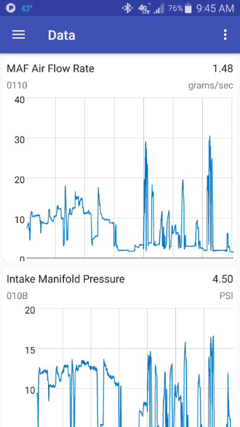

# About Link
An application for reading, logging, and visualizing OBD data using bluetooth ELM327 based protocols.

# Prerequisites
Link has only been tested on Android 6.0 and newer. Support for older android versions is limited, and anything older than 4.4 should be considered unsupported. The minimum supported version in the Play Store version is 5.0.

If developing, you will need Android Studio with the ability to simulate an android device, or have a real android phone to do live testing with.

# Using Link

## Getting Started
The easiest way to install it is from the Play Store. https://play.google.com/store/apps/details?id=beze.link
Future releases may come packaged with the apk to install directly to your phone, but currently there is no support for it.
If you want to build the APK manually, you can, and install it that way. This would be useful mostly for developers.

## Viewing Data
Link will remember last connected devices, and automatically connect to them.
For new connections (or first time starting the app), go to the Settings in the top right 3-dot menu.
Select 'Bluetooth Device' and pick an option of paired devices from the list.
When the app starts, it will be on the Home page attempt connecting. Once connected, the VIN and basic vehicle info will be displayed.

If the connection succeeds the user will be notified through a toast message (those pop up messages towards the bottom of the screen).
If a success message is not seen or the Home page does not update, you can try tapping Disconnect, or restarting the app.
Some cheaper, knock-off ELM327 devices may even need to be unplugged and re-plugged in to be reconnected.

Once connected, the nagivation menu in the top left (3-line menu) will show a "PIDs" option. This is where you select parameters to view on your vehicle.
Not all parameters are supported by any given vehicle, if a PID is supported it will show a green check mark next to it. If unsupported a red X.
If a question mark, it means the PID is not yet or cannot be validated.
Not all PIDs with a green check are truly supported. Some vehicles support a PID with one way of calculating values, and others support the same PID in a different way.
It is up to the user to know which PIDs are truly supported, and the green/red marks should be used as a suggestion.

After selecting your PIDs, go to the navigation menu and tap Data. The values will then live update as long as you stay on this view.

## Options ##

In the Settings (3-dot menu, top right), there are a few options users can use beyond selecting their bluetooth device.

### Display Metric units ###

Default off. If selected Metric units are displayed, otherwise Imperial units are used.

### Bluetooth Device ###

Default is not set. Needs to be set when the app is first installed. The device must have been previously paired.

### Show PID stream values ###

Default off. Shows the hexidecimal byte values sent to the ELM327 device for each PID in the Data window.

### Keep screen awake ###

Default on. Prevents the screen from sleeping when viewing live data. Only applies to Data window. Useful for viewing longer durations of data.

### Show data graphs ###

Default off. Shows data over time on a graph in the Data window. This may be slow and use noticeable battery life on older phones when used with many PIDs.

### Simulate ELM327 data ###

Default off. Uses simulated values (read as random values) instead of connecting to an actual ELM327 device. This is useful for debugging when not in a vehicle and also just testing the application.

